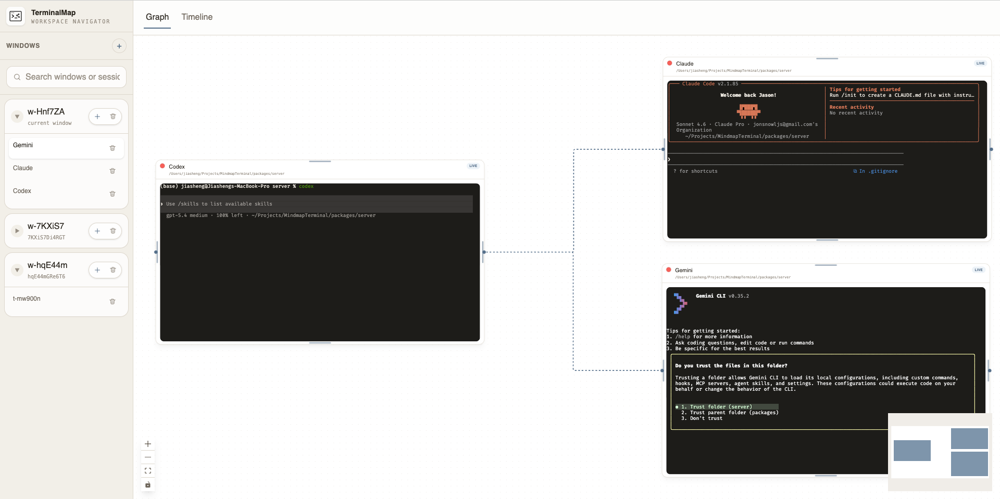

# TerminalMap



A local-first developer tool that transforms terminal sessions into a branchable, searchable execution graph. 

Every command you run becomes a node in a visual DAG. You can branch from any point, explore ideas freely, and never lose context.

## Why

Modern terminal workflows are powerful but fragile. Once a session scrolls away, the reasoning behind a command chain is usually gone with it. TerminalMap turns shell activity into a persistent graph so you can:

- trace how you got to a result instead of reconstructing it from memory
- branch from any command or output to try an alternative path safely
- search past work across sessions instead of grepping shell history
- keep terminal execution, output, and structure in one place

This project is aimed at developers who think in shells but want better visibility, replayability, and exploration than a linear terminal transcript can provide.

## Quick Start

```bash
pnpm install
pnpm dev
```

That starts:

- server on `http://localhost:3001`
- client on `http://localhost:5173`

Open `http://localhost:5173` in your browser.

You can also run each package independently:

```bash
pnpm dev:server
pnpm dev:client
```

## Requirements

- Node.js 22+
- pnpm 10+
- macOS or Linux
- a POSIX shell such as `zsh` or `bash`
- native build tooling required by `node-pty` and `better-sqlite3`

Native dependencies are compiled during install. On a fresh machine you will typically need:

- Xcode Command Line Tools on macOS
- `build-essential` or equivalent compiler toolchain on Linux
- Python and a working C/C++ compiler toolchain if your environment does not already provide them

If `pnpm install` fails while building native modules, verify the compiler toolchain first.

## Configuration

The server supports these environment variables:

| Variable        | Default                             | Purpose                                                      |
| --------------- | ----------------------------------- | ------------------------------------------------------------ |
| `PORT`          | `3001`                              | HTTP and WebSocket server port                               |
| `HOST`          | `0.0.0.0`                           | Bind address for the backend                                 |
| `CLIENT_ORIGIN` | `http://localhost:5173`             | Allowed browser origin for CORS/WebSocket access             |
| `DEFAULT_CWD`   | `process.cwd()`                     | Default working directory used for spawned terminal sessions |
| `SHELL`         | inherited from the host environment | Default shell used for PTY sessions                          |

Example:

```bash
PORT=4001 CLIENT_ORIGIN=http://localhost:4173 DEFAULT_CWD=$HOME/projects pnpm dev:server
```

The SQLite database is stored locally as `mindmap.db` in the project working directory.

## Development

Common commands:

```bash
pnpm install
pnpm dev
pnpm dev:server
pnpm dev:client
pnpm typecheck
pnpm --filter @mindmap/client test
```

Notes:

- the client currently has automated Vitest coverage
- the server includes smoke tests in `packages/server/src`, but they are not yet wired into a root test script
- the root `build` script is not fully ready for public use yet because `@mindmap/shared` does not currently define a `build` script

## Verification

Before opening a PR or publishing changes, run:

```bash
pnpm typecheck
pnpm --filter @mindmap/client test
```

If you are modifying server session or graph behavior, also run the relevant smoke tests directly in the server package until they are promoted into a standard script.

## Architecture

### Monorepo Structure

```text
packages/
  shared/         @mindmap/shared — types, constants, WebSocket protocol schemas
  server/         @mindmap/server — Node.js backend (Fastify + node-pty + SQLite)
  client/         @mindmap/client — React frontend (Vite + React Flow + xterm.js)
```

### System Overview

```text
┌─────────────────────────────────────────────────┐
│                   Browser                        │
│  ┌──────────┐  ┌──────────┐  ┌───────────────┐ │
│  │ Sidebar  │  │ GraphView│  │  TimelineView  │ │
│  │ Sessions │  │ (React   │  │  (chronological│ │
│  │ Branches │  │  Flow)   │  │   list)        │ │
│  └──────────┘  └──────────┘  └───────────────┘ │
│  ┌─────────────────────────────────────────────┐ │
│  │          Terminal (xterm.js)                 │ │
│  └─────────────────────────────────────────────┘ │
│                    │ WebSocket                    │
└────────────────────┼────────────────────────────┘
                     │
┌────────────────────┼────────────────────────────┐
│              Node.js Server                      │
│  ┌──────────────┐  ┌───────────────────────┐    │
│  │ SessionManager│  │  CommandDetector       │    │
│  │ (node-pty)   │──│  (OSC 133 + regex)     │    │
│  └──────────────┘  └───────────┬───────────┘    │
│                                │                 │
│  ┌──────────────┐  ┌──────────┴────────────┐    │
│  │ BranchService│  │  GraphService          │    │
│  └──────┬───────┘  └──────────┬────────────┘    │
│         │                     │                  │
│  ┌──────┴─────────────────────┴────────────┐    │
│  │         SQLite (better-sqlite3)          │    │
│  │   WAL mode · FTS5 search · FK indexes    │    │
│  └──────────────────────────────────────────┘    │
└──────────────────────────────────────────────────┘
```

### Tech Stack

| Layer               | Technology                                  |
| ------------------- | ------------------------------------------- |
| Frontend            | React 19, TypeScript, Vite, Tailwind CSS v4 |
| Graph visualization | React Flow (dagre layout)                   |
| Terminal emulator   | xterm.js v6                                 |
| State management    | Zustand                                     |
| Backend             | Node.js, Fastify, `@fastify/websocket`      |
| PTY management      | `node-pty`                                  |
| Database            | SQLite via `better-sqlite3`                 |
| Protocol            | Zod-validated WebSocket messages            |

### Data Model

```text
Workspace → Sessions → Branches → Nodes → Edges
```

- nodes represent events such as commands, output, errors, notes, and explorations
- edges represent causality between those events
- branches enable forking from any node to explore alternatives
- sessions persist independently of the UI and survive page reloads

### Key Components

#### Backend

| File                                         | Purpose                                                                             |
| -------------------------------------------- | ----------------------------------------------------------------------------------- |
| `packages/server/src/pty/SessionManager.ts`  | PTY lifecycle: create, attach, detach, resize, kill                                 |
| `packages/server/src/pty/CommandDetector.ts` | Command boundary detection via OSC 133 shell integration plus regex fallback        |
| `packages/server/src/pty/OutputBuffer.ts`    | Output accumulation between commands with size limits                               |
| `packages/server/src/graph/GraphService.ts`  | Node and edge persistence against SQLite                                            |
| `packages/server/src/graph/BranchService.ts` | Branch creation and traversal                                                       |
| `packages/server/src/ws/handler.ts`          | WebSocket message dispatch for sessions, terminal I/O, graph queries, and branching |
| `packages/server/src/db/schema.sql`          | Database schema for workspaces, sessions, branches, nodes, edges, and FTS5 indexes  |

#### Frontend

| File                                                       | Purpose                                                              |
| ---------------------------------------------------------- | -------------------------------------------------------------------- |
| `packages/client/src/hooks/useWebSocket.ts`                | WebSocket client with reconnect and request-response correlation     |
| `packages/client/src/hooks/useTerminal.ts`                 | xterm.js lifecycle management and auto-fit behavior                  |
| `packages/client/src/store/graphStore.ts`                  | Zustand graph state for nodes, edges, branches, and view mode        |
| `packages/client/src/components/graph/GraphView.tsx`       | React Flow canvas with graph interactions and branching entry points |
| `packages/client/src/components/graph/CommandNode.tsx`     | Command node renderer with exit code and duration                    |
| `packages/client/src/components/graph/OutputNode.tsx`      | Output preview node renderer                                         |
| `packages/client/src/components/graph/ErrorNode.tsx`       | Error node renderer                                                  |
| `packages/client/src/components/timeline/TimelineView.tsx` | Chronological activity list                                          |
| `packages/client/src/components/layout/Sidebar.tsx`        | Session list, branch tree, and navigation                            |
| `packages/client/src/components/layout/AppShell.tsx`       | Split-pane workspace layout                                          |
| `packages/client/src/lib/layout.ts`                        | Dagre-based graph layout computation                                 |

### WebSocket Protocol

All messages follow an `{ id, type, seq, payload }` envelope.

Client to server:

- `session.create` / `session.attach` / `session.detach` / `session.list`
- `session.resize`
- `terminal.stdin`
- `graph.get` / `graph.search`
- `branch.create` / `branch.switch` / `branch.list`

Server to client:

- `terminal.stdout`
- `session.created` / `session.attached` / `session.exited`
- `node.created` / `node.updated` / `edge.created`
- `branch.created`

### How Command Detection Works

Terminal output is fed through `CommandDetector`, which uses two strategies:

1. OSC 133 shell integration for precise command start, execution, and exit-code boundaries.
2. Regex fallback for common prompts such as `$`, `%`, `#`, `❯`, and `➜`, combined with stdin tracking.

When a command boundary is detected, a node is created in SQLite and broadcast to attached clients over WebSocket.

### How Branching Works

1. Right-click any node in the graph view.
2. Select "Branch from here".
3. The server creates a new branch record linked to the fork node.
4. New commands on that branch are stored with the new `branchId`.
5. Switch branches from the sidebar.
6. The graph view renders diverging edges from the fork point.

## Project Status

This project is still in MVP stage. It is usable for local exploration and architecture validation, but it is not yet hardened for production or team-wide adoption.

Working today:

- real PTY-backed terminal sessions
- automatic command detection and graph node creation
- visual DAG rendering with layout, zoom, pan, and minimap
- graph and timeline views
- branch creation from existing nodes
- SQLite-backed session persistence
- multiple sessions with sidebar navigation
- FTS5 search on command content
- resizable split-pane workspace UI

## Known Limitations

- local-first only; there is no multi-user sync or hosted deployment story yet
- currently optimized for macOS and Linux workflows
- command detection depends on shell behavior and prompt patterns, so edge cases still exist
- automated test coverage is stronger on the client than on the server
- persistence is SQLite-backed and local to the running environment
- security hardening, auth, and sandboxing are not productized yet

## Non-Goals

At this stage, TerminalMap is not trying to be:

- a remote terminal hosting platform
- a full shell replacement
- a collaborative cloud IDE
- a generic observability product for arbitrary process graphs

## Roadmap

Near-term areas of work:

- improve terminal workspace and canvas interactions
- standardize server test execution and CI verification
- strengthen command detection across more shells and prompt styles
- improve session/branch UX for larger graphs
- tighten packaging and public-repo readiness for contributors

## License

This project is licensed under the MIT License. See [`LICENSE`](./LICENSE).
